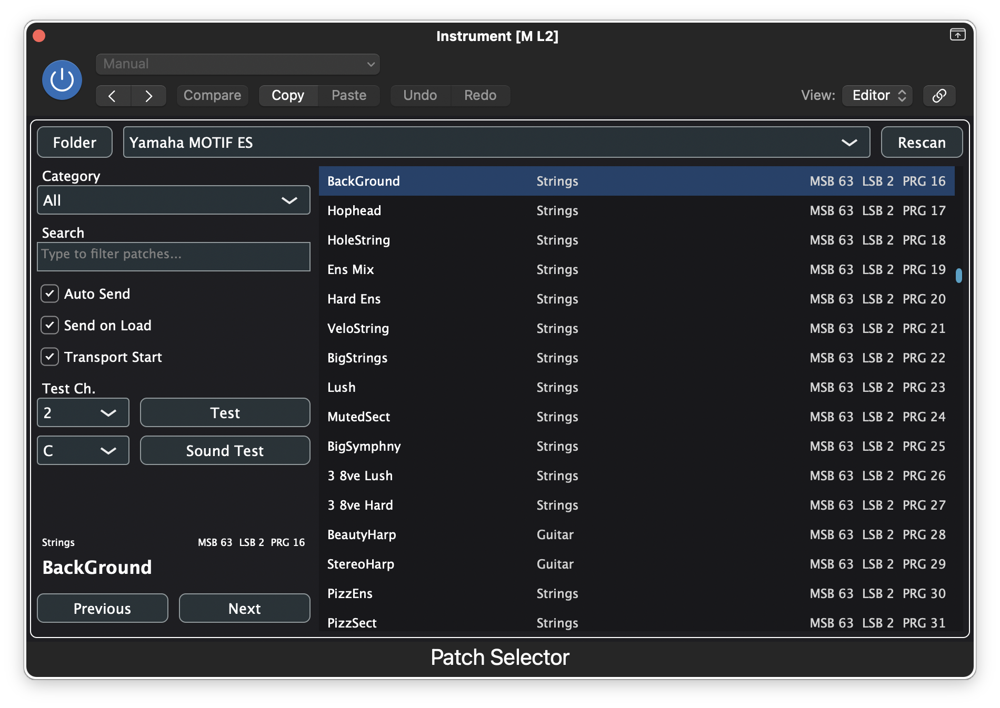

# Patch Selector

[English](./README.md) | Italiano



Patch Selector e un plugin MIDI effect basato su JUCE per host macOS come Logic Pro e MainStage.
Carica librerie patch in formato JSON, permette di sfogliare le patch per categoria e nome, e invia messaggi MIDI Bank Select (`CC0` / `CC32`) e Program Change verso sintetizzatori hardware esterni.

Questo repository e strutturato per essere semplice da compilare localmente e pronto per evolvere come progetto open source.

## Funzionalita

- target AU, VST3 e Standalone costruiti con CMake e JUCE
- caricamento di librerie patch in JSON
- workflow con cartella librerie dedicata e supporto al rescan
- filtro patch per categoria e ricerca testuale
- navigazione patch precedente / successiva
- stato persistente del plugin
- invio MIDI automatico e manuale
- sound test con accordo e canale MIDI selezionabili

## Stato Del Progetto

Il progetto e utilizzabile, ma ancora in evoluzione.

Priorita attuali:

- affidabilita dentro Logic Pro e MainStage
- miglioramenti di compatibilita delle librerie patch
- qualita del workflow con sintetizzatori hardware esterni
- affinamento dell'interfaccia per librerie piu grandi

## Piattaforme Supportate

- macOS
- AU, VST3, Standalone
- toolchain Xcode

Il caso d'uso principale e un MIDI effect su una traccia host che controlla un sintetizzatore esterno.

## Struttura Del Repository

```text
Source/
  PluginProcessor.*         Logica del plugin e stato
  PluginEditor.*            Interfaccia JUCE
  midi/                     Logica di dispatch MIDI
  model/                    Tipi del modello libreria patch
  repository/               Caricamento e validazione JSON
resources/                  Risorse runtime e asset librerie
JUCE/                       Dipendenza JUCE inclusa nel repo
build-xcode/                Directory locale di build Xcode/CMake
```

## Requisiti Di Build

- macOS
- CMake 3.22+
- Xcode

JUCE e incluso in questo repository, quindi non serve una installazione separata con `find_package(JUCE ...)`.

## Build

Configurazione:

```bash
cmake -S . -B build-xcode -G Xcode
```

Build:

```bash
cmake --build build-xcode --config Release
```

Vengono generati:

- Audio Unit (`.component`)
- VST3 (`.vst3`)
- app Standalone

### Build Universal Per Apple Silicon E Intel

Il progetto e configurato per generare binari macOS universal con entrambe le architetture:

- `arm64`
- `x86_64`

Questo e importante se vuoi che il plugin AU funzioni sia su sistemi Apple Silicon sia su host Intel come MainStage 3.6.4 eseguito nativamente su Mac Intel.

Se cambi le impostazioni di architettura in `CMakeLists.txt`, devi rieseguire la configurazione CMake prima della build, altrimenti Xcode puo continuare a usare impostazioni generate in precedenza.

Per verificare il binario AU risultante:

```bash
lipo -info "build-xcode/PatchSelectorPlugin_artefacts/Release/AU/Patch Selector.component/Contents/MacOS/Patch Selector"
```

L'output dovrebbe indicare sia `arm64` sia `x86_64`.

## Uso

1. Compila il progetto.
2. Apri l'app standalone oppure carica il plugin AU/VST3 in un host.
3. Usa il pulsante cartella per aprire la directory delle librerie.
4. Aggiungi uno o piu file JSON di libreria patch.
5. Esegui `Rescan`.
6. Seleziona una libreria, sfoglia le patch e invia i messaggi bank/program desiderati.

## Cartella Librerie

Il plugin cerca le librerie JSON in:

- `~/Library/Application Support/PatchSelectorPlugin/Libraries`

## Formato Della Libreria JSON

Esempio minimo:

```json
{
  "device": {
    "manufacturer": "Generic",
    "model": "My Synth",
    "defaultMidiChannel": 1,
    "programBase": 1
  },
  "patches": [
    {
      "msb": 0,
      "lsb": 0,
      "program": 1,
      "name": "Grand Piano",
      "category": "Piano"
    }
  ]
}
```

Il loader e volutamente tollerante e supporta diversi alias e formati rilassati per essere compatibile con librerie reali.

## Generare Librerie Con L'IA

Puoi usare ChatGPT o un altro strumento di IA generativa per produrre un file JSON di libreria compatibile con Patch Selector.

Workflow consigliato:

1. Raccogli l'elenco patch del sintetizzatore da manuale, PDF del produttore, foglio di calcolo o fonte affidabile.
2. Chiedi all'IA di normalizzare quei dati nel formato JSON atteso dal plugin.
3. Controlla con attenzione i valori `msb`, `lsb`, `program`, `name` e `category` prima di usare il file in un setup reale.
4. Salva il risultato come file `.json` dentro:
   `~/Library/Application Support/PatchSelectorPlugin/Libraries`
5. Apri il plugin e premi `Rescan`.

Prompt suggerito in inglese:

```text
Create a valid JSON patch library for the Patch Selector plugin.

Output only raw JSON, with no Markdown fences and no explanation.

Requirements:
- The root object must contain a "device" object and a "patches" array.
- The "device" object must include:
  - "manufacturer"
  - "model"
  - "defaultMidiChannel"
  - "programBase"
- Each item in "patches" must include:
  - "msb" as integer
  - "lsb" as integer
  - "program" as integer
  - "name" as string
  - "category" as string
- Use category names that are useful for filtering, such as Piano, EP, Organ, Pad, Strings, Brass, Lead, Bass, Drum, Synth, FX, Voice, Guitar, or Misc.
- Preserve the original patch names exactly when possible.
- Do not invent patches that are not present in the source material.
- If bank numbering or program numbering is ambiguous, keep the most likely values and add a top-level string field named "notes" explaining the assumption.
- Assume programBase is 1 unless the source clearly uses zero-based program numbering.
- Return strictly valid JSON.

Use this synth data as source material:
[PASTE HERE THE PATCH LIST, BANK TABLE, OR MANUAL EXCERPT]
```

Se conosci gia il modello esatto del sintetizzatore, puoi rendere il prompt piu specifico, ad esempio:

```text
Create a Patch Selector JSON library for a Yamaha Motif ES from the following source material...
```

Consigli pratici:

- chiedi al modello di lavorare su una tabella incollata, un estratto del manuale o testo OCR invece che sulla memoria interna
- per sintetizzatori grandi, genera una banca alla volta e unisci solo dopo aver verificato il risultato
- se il materiale sorgente e disordinato, chiedi prima una tabella pulita e poi in un secondo passaggio il JSON finale
- verifica sempre alcune patch reali sullo strumento prima di fidarti dell'intera libreria

## Note Di Progetto

- Il plugin non apre direttamente porte MIDI hardware.
  L'host deve instradare il MIDI verso lo strumento di destinazione.
- Il plugin non acquisisce l'audio hardware.
  In Logic Pro, abbinalo a External Instrument o a un percorso di ritorno dedicato.
- I messaggi MIDI generati richiedono comunque un canale MIDI esplicito.
  Non ereditano automaticamente il canale della traccia host, a meno che il plugin non lo ricavi dal MIDI in ingresso.

## Open Source

- Licenza: [MIT](./LICENSE)
- Guida ai contributi: [CONTRIBUTING.md](./CONTRIBUTING.md)
- Codice di condotta: [CODE_OF_CONDUCT.md](./CODE_OF_CONDUCT.md)
- Security policy: [SECURITY.md](./SECURITY.md)

## Contribuire

Bug report, miglioramenti di compatibilita del parser, feedback sul workflow e pull request mirate sono benvenuti.

Prima di aprire un contributo piu ampio, leggi [CONTRIBUTING.md](./CONTRIBUTING.md).

## Idee Per La Roadmap

- supporto SysEx
- metadati patch piu ricchi
- strumenti di import per piu formati vendor
- validazione migliore specifica per host
- test di regressione su parsing e comportamento MIDI

## Licenza

Questo progetto e distribuito con licenza [MIT](./LICENSE).
